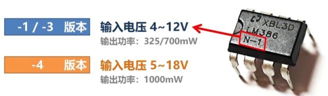
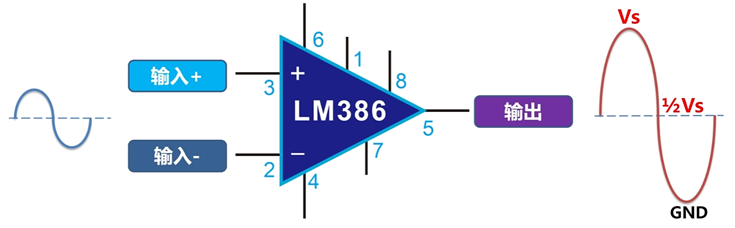
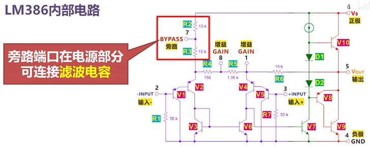
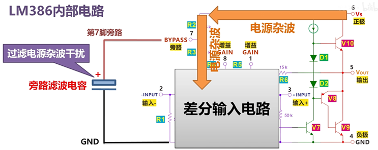
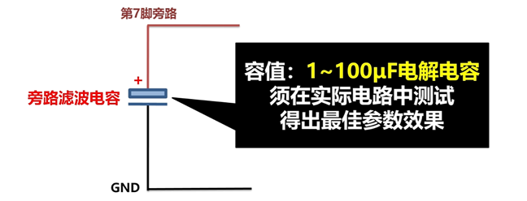
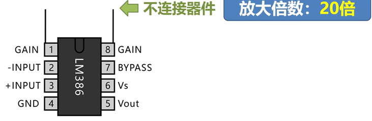
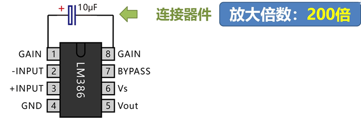
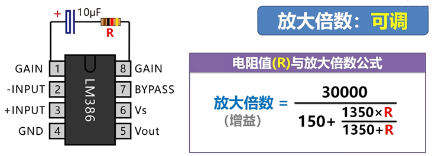
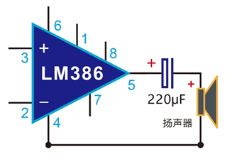

## 一、LM386不同版本的电源

LM386有三种不同的型号，分别是 `LM386-1`，`LM386-3`以及`LM386-4`这三个版本，本次项目设计使用的是`LM386-1`版本。

## 二、LM386的基本功能引脚

LM386的引脚功能如下：

| 引脚 | 名称（常用）    | 一句话功能说明                                                                                   |
| ---- | --------------- | ------------------------------------------------------------------------------------------------ |
| 1    | GAIN 设定端 A   | 与 8 脚配合，外接 RC 可把电压增益从 20 倍连续调到 200 倍；直接短路或仅接 10 µF 时得最大 200 倍。 |
| 2    | −IN（反相输入） | 信号地参考端，一般接地或接反馈电阻；与 3 脚构成差分输入。                                        |
| 3    | +IN（同相输入） | 真正音频信号入口，输入阻抗 ≈ 50 kΩ，耦合电容 0.1–10 µF 即可。                                    |
| 4    | GND            | 电源地，也是散热参考点；高频应用时要与 7 脚旁路电容“星形”接地以减小自激。                        |
| 5    | OUT             | 功放输出，直流已偏置到 VCC/2，必须串 220–470 µF 电解（+极接 5 脚）再驱动扬声器。                 |
| 6    | VCC             | 正电源 4–12 V（LM386N-4 可到 18 V），就近接 100 µF + 100 nF 去耦。                               |
| 7    | BYP（旁路）     | 内部参考节点；对地接 10 µF 电解可滤除纹波、抑制高频自激，Layout 时尽量靠近芯片。                 |
| 8    | GAIN 设定端 B   | 与 1 脚配合使用；空脚时增益 = 20 倍，与 1 脚并 10 µF 时增益 = 200 倍。                           |

**特点1**
当同相输入和反相输入端的输入电平相等时，输出端将输出`Vs/2`电源电压，也就是2.5V（供电电压5.0V）

**特点2**
当两个输入端产生正负电压差，差值的电压将被放大，在 0~5V 之间，随着输入信号的波形而上下波动

**特点3**
由于输出端采用的是推挽电路，有较大的电流输出能力，可以直接推动扬声器发出声音

**特点4**
引脚7是旁路端口，这个端口在内部电路中，是在电源部分的引脚上。要知道在音频放大倍数较大的时候，比如200倍，就会把电源部分产生的干扰，杂音也一并放大，使喇叭中产生滋滋的电流声，所以在电源部分引出一个旁路引脚，通过与GND负极之间连接一个电容，在电源干扰还没有传到放大电路之前，就在旁路电容中滤除了，从而解决掉电源杂音的问题。

**特点5**
电容值通常会采用`1uF~100uF`之间的电解电容，具体数值需要根据实际电路来确定。另外，并不是每一个电路都需要添加(旁路)电容，只有当听到输出端有杂音的时候，才有必要连接这个滤波电容。

**特点6**
第1脚和第8脚是放大增益调节端口，可以理解为放大倍数的设置端口，当两个端口什么都不连接，放大倍数是最小值（20倍）

在两个引脚上串联一个10uF电容，则设置为200倍放大

当在10uF电容上继续串联一个电阻，就可以通过修改电阻值，进而调节放大倍数在20倍~200倍之间，电阻值和放大倍数的关系，可以利用图中的计算公式进行确定。

需要注意的是，扬声器发出的声音并不是越大越好，如果太大会导致破音失真，所以具体倍数需要在实际测试中进行调节确认。

## 三、LM386的应用

LM386的第5脚输出端口，连接扬声器时需要串联一个200uF~300uF的电解电容，用于只通过交流的音频信号

